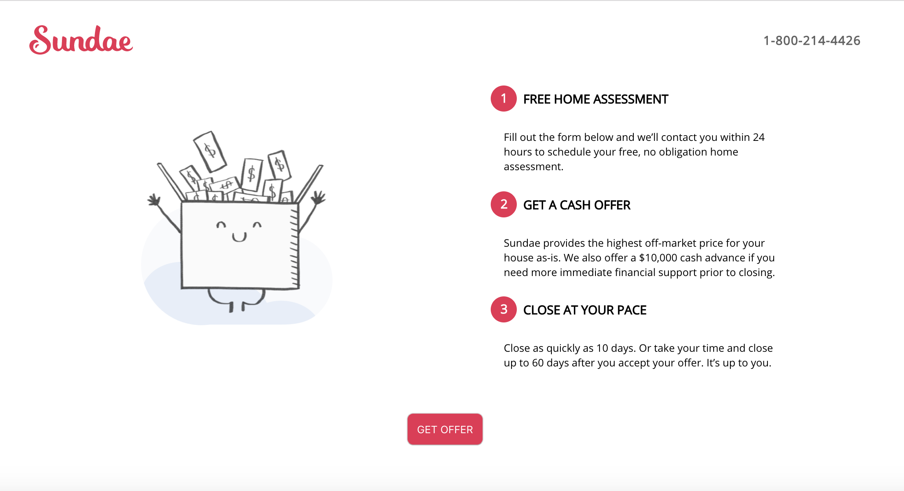

# Sundae-Take-Home

Re-creation of Sundae page

1. git clone from this repo ("https://github.com/justiny2c/Sundae-Take-Home")
2. cd into `app-name` folder
3. run npm start to run server

## Framework

1. React is the only framework used for the project
2. If more styling is needed, I would use Material UI components

## Styling

1. All styling is done on App.css
2. Components are in the Components Folder (NavBar, Main)
3. Mobile responsive at max-width(900px)
4. Hover animation for button
5. Button click goes to Sundae's actual link

## Breakthroughs/Blockers or What I would Change

1. Used Chrome devtools to help styling, and use actual links for images
2. No real blockers besides styling in a short time (spent ~1 hr)
3. With React, I would create Routes (as for the button click) to allow for a faster UI
4. Also, compress CSS and Javascript code to also reduce load times (the more white space, the longer the load times)
5. Optimize images on the website (in which I think a lot of them are already)
6. Lastly, for the Sundae's website in general, I feel some pages have longer scrolled pages. I might look into breaking components/sections up on tab clicks or maybe even different routes
